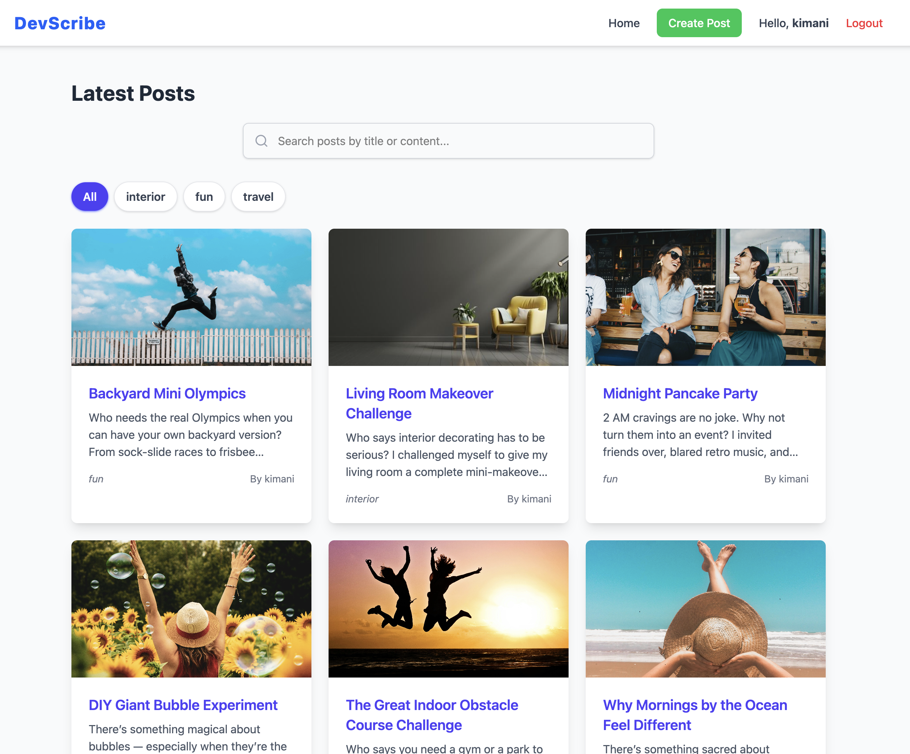

📰 MERN Blog Platform
A modern, full-stack blog application built with the MERN stack — featuring authentication, image uploads, and category-based post organization.

Overview

This is a fully functional MERN CRUD Blog App that allows users to create, edit, delete, and view blog posts. It includes secure authentication (JWT), protected routes, and responsive UI styling with Tailwind CSS.

Key highlights:

User authentication (register/login)

Category management

Image upload via Multer

Toast notifications for feedback

MongoDB for persistent data storage

⚙️ Setup Instructions
1️⃣ Clone & Install
git clone https://github.com/PLP-MERN-Stack-Development/plp-mern-stack-development-classroom-mern-stack-integration-MERN-Stack-Week4
cd mern-blog

Install dependencies:

cd server && npm install
cd ../client && npm install

2️⃣ Add Environment Variables

/server/.env

PORT=5000
MONGO_URI=your_mongodb_connection_string
JWT_SECRET=your_secret_key

/client/.env

VITE_API_URL=http://localhost:5000/api

3️⃣ Run the Application
# Start backend
cd server && npm run dev

# Start frontend
cd ../client && npm run dev

Then visit 👉 http://localhost:5173

 Features

✅ Register and Login using JWT
✅ Create, Edit, and Delete Blog Posts
✅ Upload Featured Images (Multer)
✅ Dynamic Category Creation and Selection
✅ Protected Routes for Authorized Users
✅ Responsive and Clean UI with Tailwind CSS
✅ Success and Error Toast Notifications

📡 API Endpoints
Method	Endpoint	Description
POST	/api/auth/register	Register new user
POST	/api/auth/login	Login user
GET	/api/posts	Fetch all posts
POST	/api/posts	Create post (Protected)
GET	/api/posts/:id	Get a single post
PUT	/api/posts/:id	Update a post (Protected)
DELETE	/api/posts/:id	Delete a post (Protected)
GET	/api/categories	Fetch all categories
POST	/api/categories	Create category

📁 Folder Structure
mern-blog/
├── client/ (React Frontend)
│   ├── pages/
│   ├── components/
│   ├── context/AuthContext.jsx
│   └── services/api.js
└── server/ (Express Backend)
    ├── controllers/
    ├── routes/
    ├── models/
    ├── middleware/
    └── server.js

🧠 Future Enhancements

💬 Comment system

👤 User profile pages

### SCREENSHOTS

### 🏠 Home Page

### ✏️ Blog

### 🔐 createpost

### ✏️ Delete and edit

